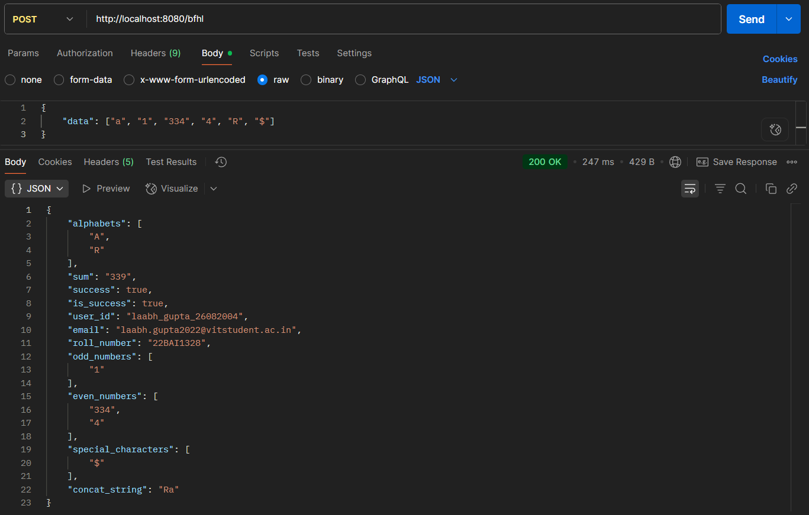

# Full Stack API Task - BFHL

This project is a REST API created for the Bajaj Finserv assessment. It processes an array of data and returns a structured JSON object containing user information, sorted lists of numbers and alphabets, and calculated values.

---

## Tech Stack
- **Java 17**
- **Spring Boot**
- **Maven**

---

## API Endpoint Details

The API is hosted on Railway and is publicly accessible.

**Live URL:** `https://bajajfinservbfhl-production.up.railway.app/bfhl`

### Endpoint
- **Method:** `POST`
- **Route:** `/bfhl`

### Request Body
The endpoint expects a JSON object with a single key, `data`, which holds an array of strings.

```json
{
    "data": ["a", "1", "334", "4", "R", "$"]
}
```

### Success Response
A successful request will return a `200 OK` status with the following JSON structure.

```json
{
    "alphabets": [
        "A",
        "R"
    ],
    "sum": "339",
    "is_success": true,
    "user_id": "laabh_gupta_26082004",
    "email": "laabh.gupta2022@vitstudent.ac.in",
    "roll_number": "22BAI1320",
    "odd_numbers": [
        "1"
    ],
    "even_numbers": [
        "334",
        "4"
    ],
    "special_characters": [
        "$"
    ],
    "concat_string": "Ra"
}
```
---

## How to Run Locally

1.  Clone the repository:
    ```sh
    git clone <your-repo-url>
    ```
2.  Navigate into the project directory:
    ```sh
    cd <your-repo-folder>
    ```
3.  Run the application using Maven:
    ```sh
    mvn spring-boot:run
    ```
The application will start on `http://localhost:8080`.

---

## Live API Screenshot

The following image shows a successful test of the live API using Postman.

